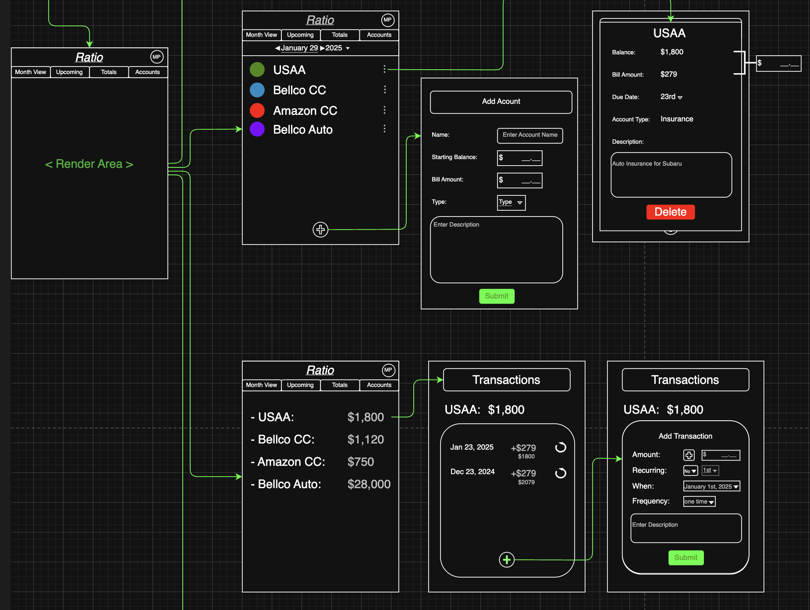

# Ratio

### Graphical User Interface

#### Login and Signup Screens:

#### User flow through the app:

#### Checking off bills from list:

#### Architecture (WIP):

- Frontend UI

  - Frameworks like React, Vue, Angular

  - Handles presentation logic (what the user sees)

- Frontend API Layer (Client-Side Logic)

  - Fetches data using HTTP (usually with Axios or Fetch)

  - May include services/hooks for calling backend endpoints

- Backend API (Express/Flask)

  - Exposes RESTful or GraphQL endpoints

  - Handles HTTP requests and responses

- Controllers

  - Accept incoming requests

  - Validate inputs (DTO: Data Transfer Objects / Joi schemas)

  - Call business logic/services or repositories

  - Return response to frontend

- Services (Business Logic Layer)

  - Contains core business rules (e.g. recurring invoice generator, auth flows)

  - Should be independent of Express or the ORM

  - Calls repository methods for DB operations

  - Repositories (Data Access Layer / Repository Pattern)

  - Encapsulates raw Sequelize/ORM calls

  - CRUD operations are abstracted into reusable methods

- ORM (Object Relational Mapper)

  - Sequelize, SQLAlchemy, etc.

  - Maps JS/Python classes to SQL tables

  - Talks to the database

- Database (Server/Storage Layer)

  - PostgreSQL, SQLite, MySQL, etc.

  - Stores the actual data
